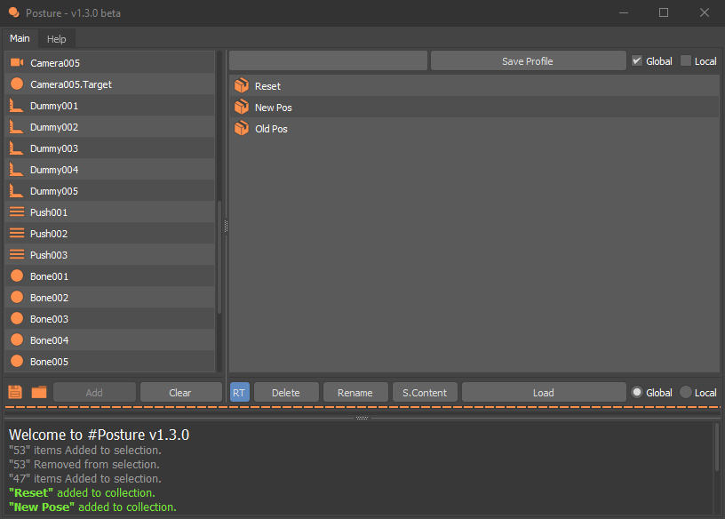

# Posture v1.3.0 beta

Autodesk 3Ds Max free pose saver
 
With Posture, you will be capable of saving multiple positions of unlimited objects! data can be stored in two ways, global and local (parent-related) or even both of them at the same time, therefore it is capable of storing character figures and different decoration of elements as well. Furthermore, few other pieces of information will be stored from selected objects, like WireColor, Parent, Children list, Name.

with Posture, you will be able to recreate empty nodes, which were deleted. They will be recreated with the same name, color, and hierarchical connection.

#   What type of data can be stored?
 
       1. Transform (position, rotation, scale)
       2. Parent 
       3. Children list
       4. Name
       5. Color

#   What type of objects can be stored?
 
       1. Geometries
       2. Shapes
       3. Lights
       4. Cameras
       5. Helpers
       6. Space warps

#   What type of nodes can be stored?
 
       1. Single nodes
       2. Multiple nodes
       3. Groups nodes
       4. Node with parent
       5. Node with children
       6. Group with parent
       7. Group with children
       8. Group and single nodes in the chain

#   With Posture you will be capable of:
  
       1. Saving unlimited profiles for any type of objects
       2. Saving parent and children of selected objects
       3. Saving information in an external file
       4. Loading information from an external file
       5. Loading Real-Time (optional)
       6. Recreating points for deleted objects
       7. Creating all hierarchical connection for recreated nodes
       8. Exporting data as an external file.
       9. Importing file from an external file.

#   Attention:
 
       1. If you are working on a rig, save controllers and helpers transform instead of rig structure.
       2. If you are saving Local (parent-related) transforms, your objects should have a parent.
       3. When you want to create a global transform, it saved absolute transform from the origin.

>Easy installation: 
	Run "One-Click Installation.bat".
	
>installation: 
	Unzip the "Posture.zip" inside "C://ProgramData//Autodesk//ApplicationPlugins".
	
>How To Run: 
	Now, it's a MacroScript, which you can assign a shortcut to it or search it using "X" in 3Ds Max.
	
>Supported Version:

    2018 - 2019 - 2020 - 2021 - 2022
	
